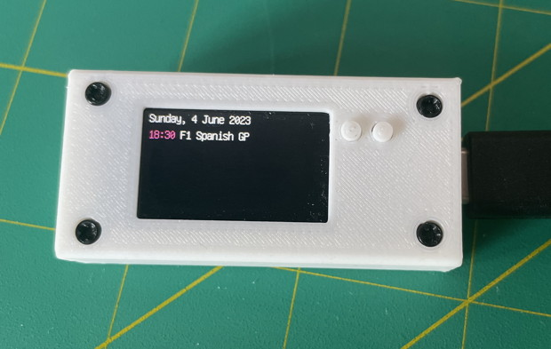
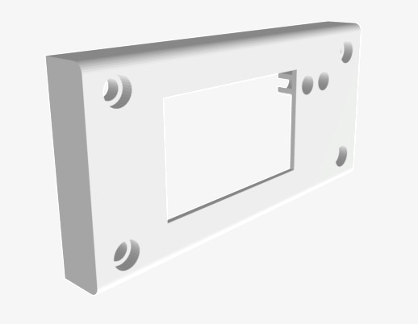

feather-tft-case
----------------

A 3D printed case for the [Adafruit feather TFT](https://learn.adafruit.com/adafruit-esp32-s2-tft-feather)

Original model is in the `*.slvs` files, created with [SolveSpace](https://solvespace.com/)

`.stl` files generated by SolveSpace.

The `.gcode` files are for the Creality Ender 3 Pro created with [Ultimaker Cura](https://ultimaker.com/software/ultimaker-cura/)

